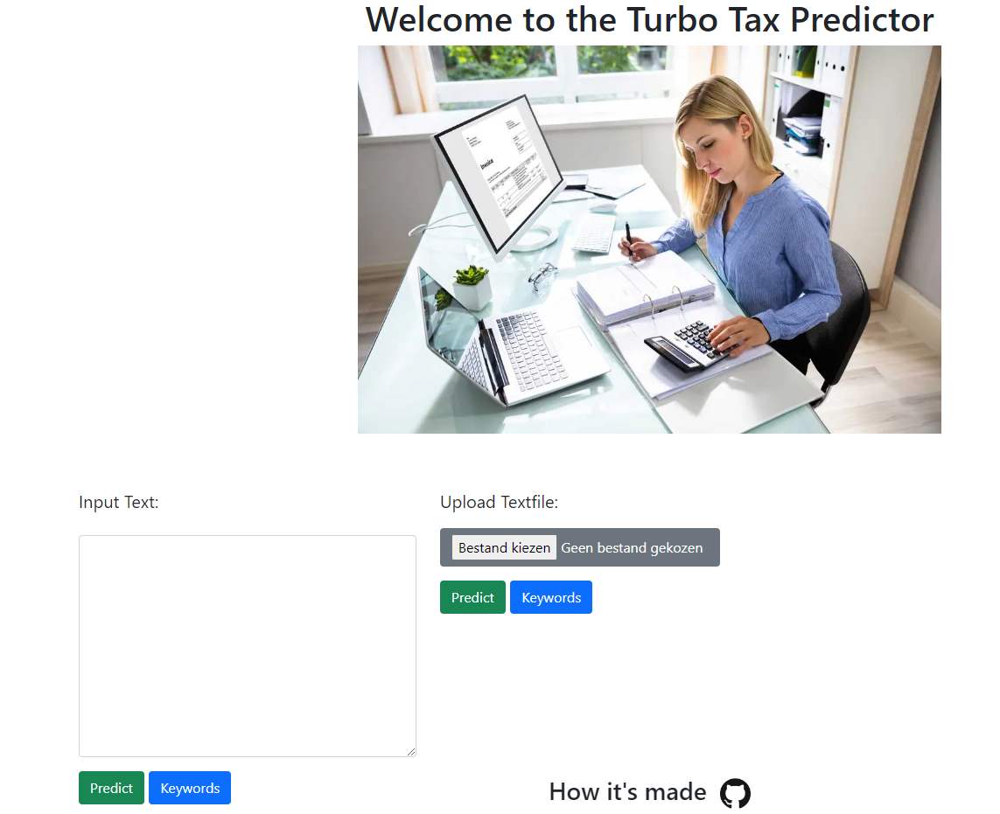

# NLP-assignment


## Desciption

This is a web app that uses NLP to classify documents from the [*Belgische Staatblad*](https://www.ejustice.just.fgov.be/cgi/summary.pl)

## Usage 

A live version can be found [here](https://tax-predict.herokuapp.com/)




## Installation

Install the required packages.

```bash
pip install -r project/requirements.txt
```

This script will scrape documents to use and generate & save the keywords. This needs to be done at least once before hosting the app locally or in docker. (This can take a while depending on your PC's specs)
```bash
python main.py
```

Host the app locally, it will be running on [localhost](http://localhost:5000/)

```bash
python app.py
```

### Docker

Build the docker image
```bash
docker build . -t tax-predict
```

Deploy the docker image to a container and run locally.
App will be running on [localhost](http://localhost:5000/)

```bash
docker run -d -p 5000:5000 tax-predict
```


## Description of the functions for notebook *KPMG_analyse.ipynb* & *keyword.py*

Before integrating the functions into our application we created and tested them out in a notebook environment.
Hereafter is an explaination of the different functions that are present in this notebook.
The notebook can be found under directory 'notebook'.

### Functions

### ```nlp_cleanandlemmatize```
This function will clean a text and lemmatize it , it returns a dictionary off all words and a list of all tokens, only **'NOUNS'** are kept.

###  ```token_compare```
Compare a token against a list of tokens and using a treshold return tokens that have a similarity score higher then this treshold.


###  ```createlistofkeywords```
Discover new keywords using some initial starting keywords, return the expanded list of keywords.
    
###  ```create_pickle_keywords_and_docscores```
Discover and save a keyword list and a document score list.  

###  ```score_text```
Using list of keywords score of how related a document is to these keywords by using similarity.

###  ```create_initial_keywordlist```
Create the initial keyword list and save it.
 
###  ```get_keywordsunsupervised```
Discover keywords that have the most similarity towards the textcontent unsupervised keyword search.

###  ```score_topic_list```
Calculate a score for a list of keywords towards a text.

###  ```score_text_byvector```
Score a document using similarity of a document vector and the kyword list vector.


###  ```get_topic_byvector```
This function predicts the main topic in a document by using a list of topic keywords.
For now we have following topics:

- inkomstenbelasting
- personenbelasting
- vennootschapsbelasting
- rechtspersonenbelasting
- belasting van niet-inwoners
- belasting op de toegevoegde waarde
- internationale belastingrecht
- registratierechten
- successierechten
- douanerechten
- verkeersbelasting
- loonbelasting
- dividendbelasting
- erfbelasting
- schenkbelasting
- kansspelbelasting
- gokbelasting
- vermogensrendementsheffing
                            

The topics are lists that contain one or more related keywords to the topic.


## Contributors

### [Bouazzaoui Mohammed](https://github.com/mohammedbouazzaoui)

-  https://www.linkedin.com/in/mbouazzaoui/

- 📧 bzzmo@hotmail.com

### [Mousumi Sen](https://github.com/MousumiAria)

-  https://www.linkedin.com/in/mousumi-sen-60359a205/

- 📧 

### [Frédèrick Franck](https://github.com/FrederickFranck)

-  https://www.linkedin.com/in/fr%C3%A9d%C3%A8rick-franck/

- 📧 frederick.franck@telenet.be
